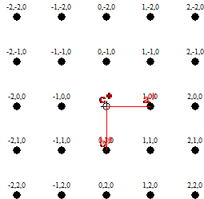
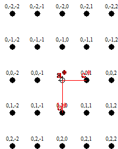

### Post Test

1.	Reciprocal lattice vector (a*) is: 
                         
                        A.<input type="radio" name="but" id="rb11" onclick="click1();">&nbsp;Parallel to real lattice vector a
                         
                        B.<input type="radio" name="but" id="rb12" onclick="click1();">&nbsp;Perpendicular to real lattice vector a
                         
                        C.<input type="radio" name="but" id="rb13" onclick="click1();">&nbsp;Parallel to real lattice vector plane b-c
                         
                        D.<input type="radio" name="but" id="rb14" onclick="click1();">&nbsp;Perpendicular to real lattice vector plane b-c	
                         
                        

                         
2.	Which equivalence hold true:
                         
                        A.<input type="radio" name="but" id="rb11" onclick="click1();">&nbsp;Lλ=Rd
                         
                        B.<input type="radio" name="but" id="rb12" onclick="click1();">&nbsp;Ld=Rλ
                         
                        C.<input type="radio" name="but" id="rb13" onclick="click1();">&nbsp;LR = dλ
                         
                        D.<input type="radio" name="but" id="rb14" onclick="click1();">&nbsp;None of the above
                         
                        

                         
3.	The camera length of the instrument is constant. 
                         
                        A.<input type="radio" name="but" id="rb11" onclick="click1();">&nbsp;True
                         
                        B.<input type="radio" name="but" id="rb12" onclick="click1();">&nbsp;False
                         
                        

                         
4.	What is the zone axis for the following diffraction pattern?
                          
                         
                         
                        A.<input type="radio" name="but" id="rb11" onclick="click1();">&nbsp;[001]
                         
                        B.<input type="radio" name="but" id="rb12" onclick="click1();">&nbsp;[010]
                         
                        C.<input type="radio" name="but" id="rb13" onclick="click1();">&nbsp;[100]
                         
                        D.<input type="radio" name="but" id="rb14" onclick="click1();">&nbsp;[110]
                         
                        

                         
5.	What is the zone axis for the following diffraction pattern?
                          
                         
                         
                        A.<input type="radio" name="but" id="rb11" onclick="click1();">&nbsp;[001]
                         
                        B.<input type="radio" name="but" id="rb12" onclick="click1();">&nbsp;[010]
                         
                        C.<input type="radio" name="but" id="rb13" onclick="click1();">&nbsp;[100]
                         
                        D.<input type="radio" name="but" id="rb14" onclick="click1();">&nbsp;[110]
                         
                        

                          
6.	What is the zone axis for the following diffraction pattern?
                         
                        A.<input type="radio" name="but" id="rb11" onclick="click1();">&nbsp;[111]
                         
                        B.<input type="radio" name="but" id="rb12" onclick="click1();">&nbsp;[011]
                         
                        C.<input type="radio" name="but" id="rb13" onclick="click1();">&nbsp;[001] 
                         
                        D.<input type="radio" name="but" id="rb14" onclick="click1();">&nbsp;[100]
                         
                        

                                                                                               