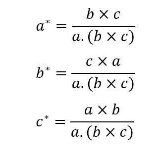
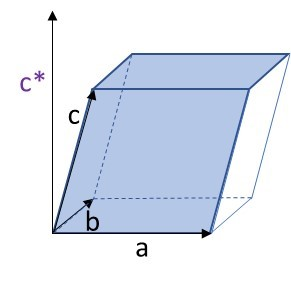
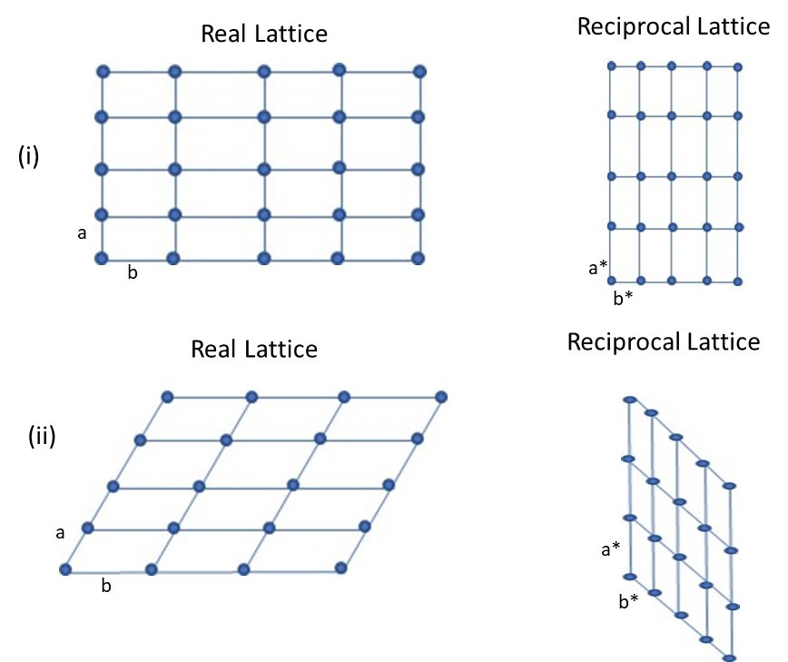
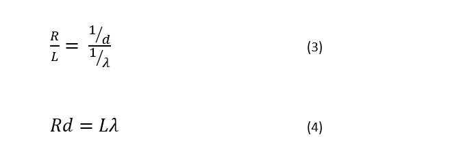
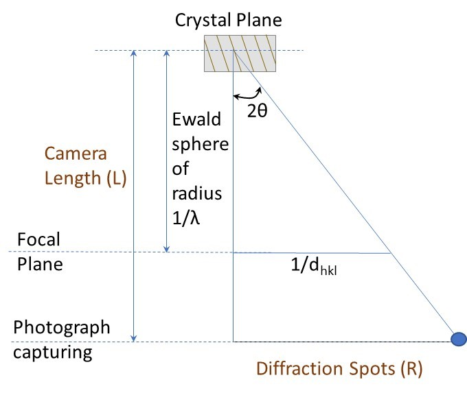
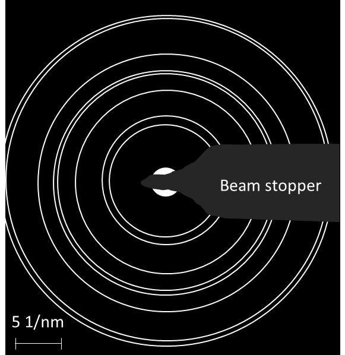
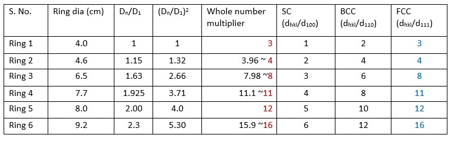
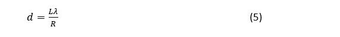
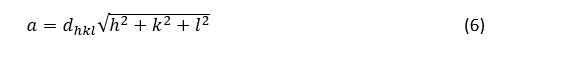
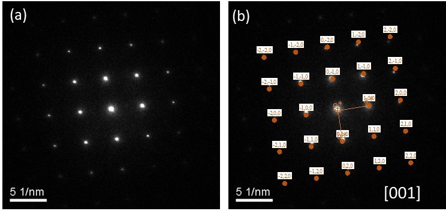

## Concept of Reciprocal Space:
When the crystal is the image in real space, the diffraction pattern is the image of crystal lattice in reciprocal space. For diffraction, the reciprocal lattice basis vector is perpendicular to a set of crystal planes that are set apart by inverse of the length of the real-space lattice basis vector. In other words, if (100) plan has unit cell parameter of a, then the reciprocal lattice of (100) will appear ‘1/a’ apart. Like real lattice vector, the reciprocal lattice vector can also be translated to another origin maintaining the symmetry. 
If we start plotting the various planes with respect to an origin, then, in the reciprocal space, the longer interplanar spacing (say for (100) plane) will fall closer to the origin, whereas intermediate planar spacing (say for (200) plane) will fall twice the length of (100) plane. This makes the crystal retain the real-space symmetry to reciprocal space. Extending this dependence, the real lattice basis vectors (a, b, and c) can be related to the basis vectors of the reciprocal space (a*, b*, c*) as:
  
 
where a.(b×c) is the volume of the real crystal unit cell. It may also be noted that the reciprocal basis vector a* is perpendicular to real space b-c plane (and so is b* perpendicular to c-a plane, and so is c* perpendicular to a-b plane), Fig. 1.   
 
Fig. 1: The reciprocal vector c* is perpendicular to a-b plane. Though the reciprocal space unit cell is NOT shown here, the length of c* lattice vector (in reciprocal space) equals to 1/c.   

In order to visualize the reciprocal space, observe that the real lattice translates to a reciprocal lattice with inverse of the spacing between the lattice points (Fig. 2(i)). The extended space along x-axis is now shortened in the reciprocal lattice. Further, the reciprocal vector is perpendicular to the other real-space lattice vector (Fig. 2(ii)). In other words, the parallelogram has now translated to the reciprocal space where a* (reciprocal space vector) is now perpendicular to real-space vector b, and b* (reciprocal space vector) is perpendicular to the real-space vector a.  
  
Fig. 2: The real-lattice translation to the reciprocal lattice is shown above. (i) Observe that rectangular lattice translates to its inverse spacing in the reciprocal space. Also, in (ii) the parallelogram lattice translates to the reciprocal lattice, where the new vectors are perpendicular to the other real lattice vector (i.e. a* is perpendicular to b, and b* is perpendicular to a). 
 
 

The same concept is extended to 3-dimension, but now here, as stated earlier, the reciprocal lattice vector is perpendicular to the plane formed by the other two real-space lattice vectors (or reciprocal space vector c* is perpendicular to plane formed by real-lattice vectors a and b). Now, as the inverse spacing relation is maintained, the diffraction obtained from the single crystals (as spot pattern) or poly-crystals (as ring pattern) may also be indexed. In other words, the orientation and inter-planar spacing (or even the crystal lattice parameter) can be calculated from the obtained diffraction.
 
 
First step is to know the wavelength of the incident beam. As presented earlier, the wavelength of incident beam is dependent on the accelerating voltage. Typically, for a beam energy of 200 keV, the electron beam wavelength is 2.51 pm. Note that the wavelength is in pico-meters (i.e. 10-3 nm).  Thus, first we need to calculate the wavelength of incident beam from the accelerating voltage being used for the TEM, which becomes the starting point. 
 
Now, the diffraction occurs when the Bragg’s condition is satisfied, i.e. 

  

  
 For very small diffraction angle (θ<<1°), Sin θ ≈ θ. Thus, the above equation for a first order diffraction (n=1), can be rewritten as:

 
Or in other words, when the inverse interplanar spacing (1/d) falls on the reciprocal Ewald’s sphere (of radius 1/λ), the diffraction will occur when the Bragg’s condition is satisfied. It may also be noted that selection rule is also followed for diffraction to occur (i.e. all the planes may not result a spot even when the relation is satisfied). 
From the schematic, Fig. 3, note that the diffraction angle is 2θ. Now, using the property of similar triangles,   
  
Where L is the camera length and R is the spacing between the diffraction spots.  
 
Fig. 3: Similar triangle allowing to relate the interplanar spacing to separation between diffraction spots and the relating Ewald sphere of radius 1/λ to the camera length. In this fashion the real space parameters are linked to reciprocal space parameters.  

Second step is to now obtain the physical parameters from the ring or spot pattern. 

 

## Evaluating Ring Pattern:
We shall start with ring-pattern first (Fig. 4). Take the print-out of the image or keep the screen magnification fixed, and then note the radius of each ring. For better accuracy, it is better to measure diameter and then divide by two because the center point is not clear, so error might be higher. Now take the ratio of the radius (or diameter, as the divider of two will cancel for each radius) of the rings one by one. Now, we need to know the correlation with the interplanar spacing of the crystals (say SC, BCC and FCC), and we will be able to find which crystal actually shows this symmetry. 
  
 
Fig. 4: A model ring-pattern for learning the indexing of the diffraction pattern.
   
Table 1: The correspondence of the ring pattern to the crystal structure.  
 

 
Now, once the crystal structure is identified, then the lattice parameter needs to be evaluated. First, we may obtain the camera length (L) using a standard crystal (say of gold) with known lattice parameter. Here, say the camera length is 1.86 m. Note that the values are in meters! Then, for a given set of condition and accelerating voltage, we can obtain camera constant (i.e. Lλ for a set of fixed parametric conditions). Here, the wavelength is 2.51 pm, so the value of L.λ is 4.67 Å.cm (= 1.86 m ×2.51 pm). Now, once the camera constant is known, then from equation (4), i.e. Rd = Lλ, from the actual diameter of the points (or rings), the value of d (or interplanar spacing can be calculated).  
From Table 1, the ring diameter for (111) plane is 2 cm. Thus, using equation (4):  
 
Or the value of d comes out to be 2.335 Å (or 0.2335 nm). Now, as we have identified the crystal to be a cubic crystal, and for a cubic crystal a=b=c. Then, for the (hkl) plane, the identified plane can be utilized to calculate the lattice parameter using the relation:  
 
as we have identified the first diffracting plane to be (111). Thus, value of lattice parameter is obtained as 4.044 Å (0r 0.4044 nm).  

## Evaluating Spot Pattern:
Evaluation of the spot pattern preserves the vector relationship as each spot represents diffracting plane, and multiple crystals have NOT overlapped to convert that to a ring pattern. Once, a spot pattern is obtained (Fig. 5), the angles between the planes are preserved and also the separation distance is inverse of the spacing between the two planes (appearing as spot in the diffraction pattern).  From here, we observe the symmetry, which appears to be four fold, but a closer look (calculating the distance and angle between the spots) can only confirm if the sample has 4-fold symmetry or a 1 fold symmetry for the given zone axis. Now, assuming that the crystal has 4-fold symmetry here, then the crystal can either be a cubic crystal or even a tetragonal crystal (as the third axis is not imaged here). Thus, to render a 3-D symmetry, diffraction from the other zone axis incorporating the third axis also needs to be undertaken.  
 
   
Fig. 5: a) Spot pattern obtained for a crystal, and b) The indexing of the spot pattern.
 
Usually a simple diffraction pattern (say belonging to [001] or [100] is captured, and based on that the two lattice vectors can be captured. Then, keeping one axis same, the information of the third lattice vector can be captured and indexed. In that fashion the information on the complete crystal can be obtained and indexed.
 
<h3>Notes:</h3>
(i)	A diffraction spot is obtained when the Ewald sphere (of radius 1/λ) intersects the array of reciprocal lattice points. Due to very low wavelength, the Ewald sphere is almost flat and intersects many points (unlike X-ray radiation).    
(ii)	Any point in reciprocal lattice intersects the Ewald sphere, the Bragg’s condition is satisfied and the plane diffracts. But it may be noted that each reciprocal lattice point is not really a point (due to excitation error), and can be a rel-rod, and even intersect the non-flatter region of Ewald sphere and appear as a spot on the diffraction pattern.    
(iii)	Under ideal condition, when beam is exactly parallel to zone axis, there should be no spots in diffraction pattern. So, the excitation error allows appearance of spots even when there is deviation from Bragg’s equation!     
(iv)	The separation between the planes is provided by the normal vector pointing from one plane to other.     
(v)	The angle between the planes can also be obtained by the angle between the vectors starting from origin to these two planes. Hence, the angular symmetry is also retained in the diffraction pattern of the crystals.     
<video width="320" height="240" controls>
  <source src="images/exp8-indexing-DP_mod (1).mp4" type="video/mp4">
  Your browser does not support the video tag.
</video> 
Fig:Video on Electron Diffraction for various materials
